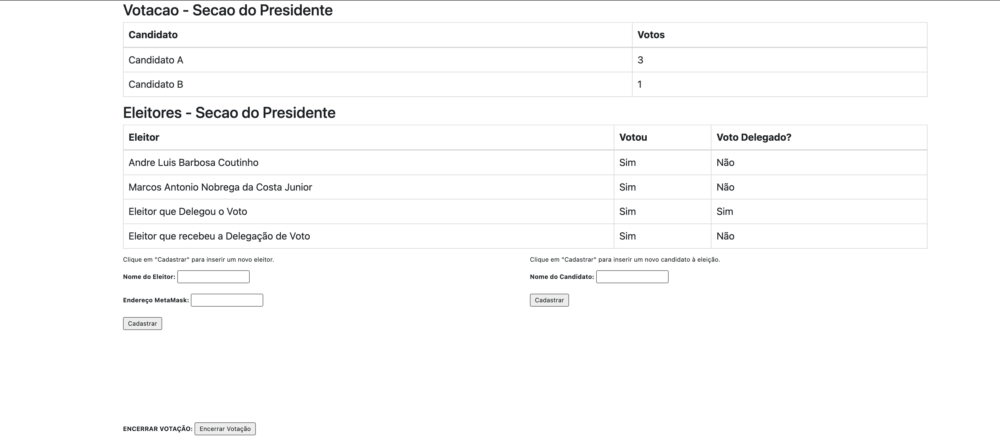
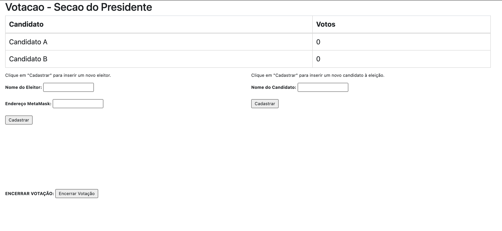
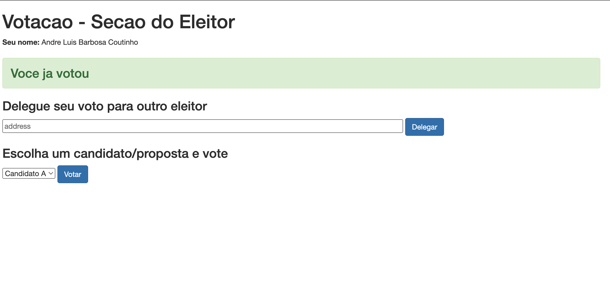
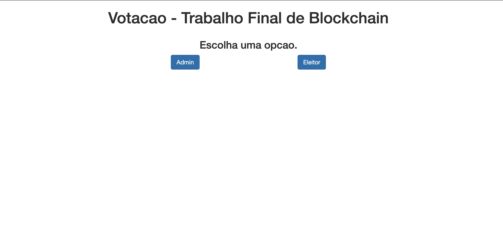
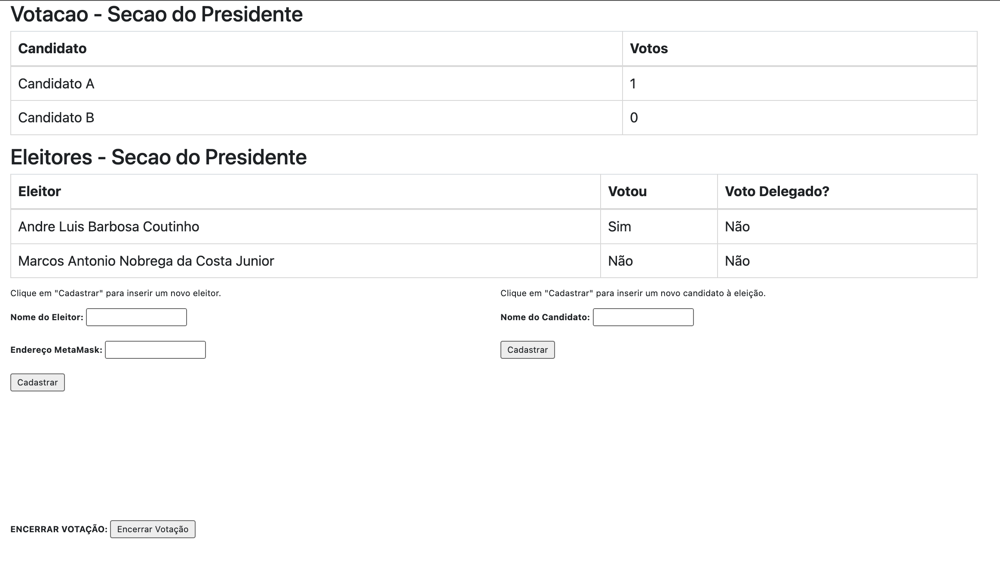

# Trabalho Final de Aplicações Descentralizadas e Blockchain

## Integrantes

- André Luis Barbosa Coutinho
- Marcos Antônio Nobrega da Costa Jr

## Descrição

Neste  trabalho,  foi utilizado  uma  aplicação  descentralizada  (dApp)  de  referência  e
modificada,  acrescentando  novas  funcionalidades.  A  aplicação  utiliza  um  contrato  inteligente
que define os meios de realizar uma eleição utilizando a rede Ethereum. Uma simples aplicação
Web demonstra como interagir com o contrato através de bibliotecas Javascript.  

## Como rodar a aplicação

Utilize  um servidor web para publicar o front-end, como por exemplo a distribuição [XAMPP](https://www.apachefriends.org/pt_br/download.html) para Windows
 ou um serviço gratuito de nuvem como
o [Heroku](https://www.heroku.com). A aplicação web irá interagir com a rede Goerli Ethereum
via [Metamask](https://metamask.io/).
O arquivo javascript da aplicação demonstra como interagir com o contrato inteligente usando
uma wallet no navegador (Metamask). Para isso, é usada a biblioteca Web3.js.

## Sobre a Stack utilizada

- [Solidity](https://docs.soliditylang.org/)
- [HTML CSS JS](https://www.w3schools.com/)
